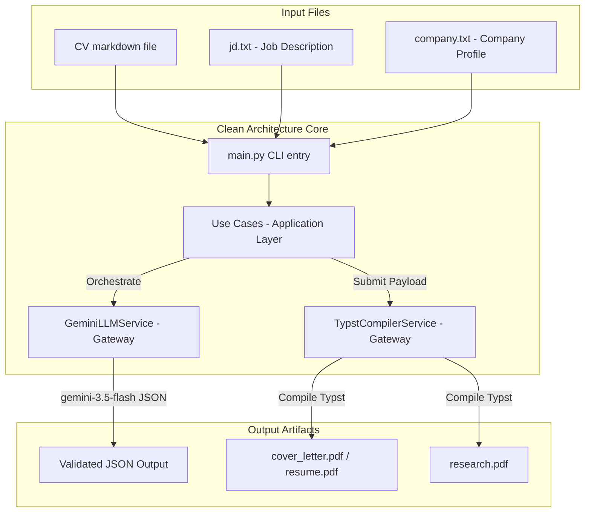

# ContextForge 🛠️

**ContextForge** is a local CLI engine and language engineering pipeline designed to automate the deterministic compilation and optimization of high-density technical resumes and cover letters. 

By utilizing **Clean Architecture** patterns, ContextForge isolates business domain models from external drivers (like Gemini and Typst). It uses a single-call structured output approach via `gemini-3.5-flash` to tailor professional profiles directly into validated JSON schemas, eliminating token rate-limit overhead.

---

## 🏗️ System Architecture & Data Flow

ContextForge separates data flow into two production-grade pipelines.

### Flow Diagram

```
1. RESUME PIPELINE:
   Agentic Flow:
   [ master_cv.md + jd.txt ] ──> [ gemini-3.5-flash ] ──> [ resume.json ] ──> [ Typst Compiler ] ──> [ resume.pdf ]
   
   Non-Agentic Flow:
   [ resume.json ] ──────────────────────────────────────────────────────────> [ Typst Compiler ] ──> [ resume.pdf ]


2. COVER LETTER PIPELINE:
   Agentic Flow:
   [ partial_master_cv.md + jd.txt + company.txt ] ──> [ gemini-3.5-flash ]
                                                              │
                                                              ▼
                                                     [ cover_letter.json ]
                                                              │
                                            ┌─────────────────┴─────────────────┐
                                            ▼                                   ▼
                                     (Cover Letter)                     (Research Summary)
                                            │                                   │
                                            ▼                                   ▼
                                    [ Typst Compiler ]                  [ Typst Compiler ]
                                            │                                   │
                                            ▼                                   ▼
                                   [ cover_letter.pdf ]                  [ research.pdf ]
   
   Non-Agentic Flow:
   [ cover_letter.json ] ──> [ Typst Compiler ] ──> [ cover_letter.pdf ] & [ research.pdf ]
```

### Pipeline Sequence (Mermaid)



---

## 📂 Project Structure

The project has been refactored into clean modular directories:

```
ContextForge/
├── artifacts/                    # Built assets (PDFs, JSONs, Typst sources)
│   ├── cover_letter.pdf
│   ├── research.pdf
│   ├── resume.pdf
│   └── ...
├── prompts/                      # LLM system prompt templates
│   ├── cover_letter.md
│   └── tailor_resume.md
├── src/                          # Clean Architecture source layer
│   ├── domain/
│   │   └── models.py             # Pydantic schemas (Resume & Cover Letter)
│   ├── gateways/
│   │   ├── llm_service.py        # Gemini client wrapper (structured JSON)
│   │   └── compiler_service.py   # Typst parser & compiler adapter
│   ├── application/
│   │   ├── compile_resume.py     # Use Case: JSON -> Resume PDF
│   │   ├── tailor_resume.py      # Use Case: CV + JD -> LLM -> Resume PDF
│   │   ├── compile_cover_letter.py# Use Case: JSON -> CL & Research PDFs
│   │   └── generate_cover_letter.py# Use Case: CV + JD + Company -> LLM -> CL & Research PDFs
│   └── infrastructure/
│       └── config.py             # Config & Environment variables loader
├── templates/                    # Default Typst document templates
│   ├── cover_letter.typ
│   ├── research.typ
│   └── resume.typ
├── tests/                        # Automated unit test suite
│   └── test_clean_arch.py
├── .env                          # Local environment API keys
├── config.yaml                   # Core path configuration
├── main.py                       # CLI application router
└── requirements.txt              # Package dependencies
```

---

## ⚙️ Setup & Installation

### 📋 Prerequisites

1. **Python 3.11+** installed.
2. A **Google Gemini API Key** (from [Google AI Studio](https://aistudio.google.com/)).
3. **Typst CLI** (optional, fallback if Python `typst` library fails).

### 🚀 Installation

1. **Clone the Repository:**
   ```bash
   git clone https://github.com/gmendozah/context-forge.git
   cd context-forge
   ```

2. **Create and Activate a Virtual Environment:**
   ```powershell
   python -m venv .venv
   .venv\Scripts\Activate.ps1
   ```

3. **Install Dependencies:**
   ```bash
   pip install -r requirements.txt
   ```

4. **Environment Configuration (`.env`):**
   Copy `.env.example` to `.env` and configure your API key:
   ```env
   GEMINI_API_KEY=your_actual_gemini_api_key_here
   ```

---

## 💻 CLI Usage Guide

ContextForge supports subcommands for both pipelines.

### 1. Resume Pipeline

* **Agentic Tailoring (Gemini Tailor + Typst Compile):**
  Reads your master CV and job description, generates a tailored JSON in `artifacts/`, and compiles it to PDF.
  ```bash
  python main.py resume --cv master_cv.md --jd jd.txt
  ```

* **Non-Agentic Compilation (Direct Typst Compile):**
  Bypasses Gemini API call. Compiles an already existing tailored JSON file to PDF.
  ```bash
  python main.py resume --json artifacts/resume.json
  ```

### 2. Cover Letter Pipeline

* **Agentic Generation (Gemini Research & Write + Typst Compile):**
  Reads your partial master CV, job description, and company profile, then produces both `artifacts/cover_letter.pdf` and `artifacts/research.pdf` (company background sheet).
  ```bash
  python main.py cover-letter --cv master_cv.md --jd jd.txt --company company.txt
  ```

* **Non-Agentic Compilation (Direct Typst Compile):**
  Bypasses Gemini API call. Compiles an already existing cover letter JSON file into both PDFs.
  ```bash
  python main.py cover-letter --json artifacts/cover_letter.json
  ```

---

## 🧪 Testing

To run the full suite of automated unit tests:
```bash
python -m unittest tests/test_clean_arch.py
```
*These tests run offline and verify formatting helper functions, Pydantic schemas, and Use Cases using mock services.*
