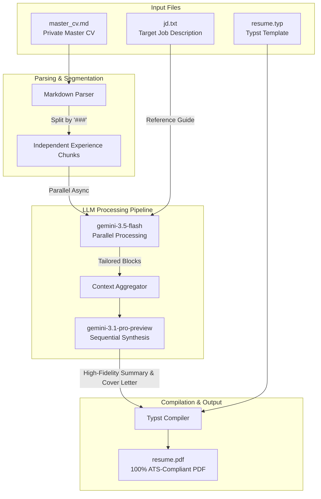

# ContextForge 🛠️

**ContextForge** is a local CLI engine and an asynchronous language engineering pipeline designed to automate the deterministic compilation and optimization of high-density technical resumes (CVs).

Unlike traditional AI-wrapped tools that suffer from **"token laziness"** (where LLMs over-summarize, omit crucial metrics, or dilute technical prose when processing massive contexts), ContextForge introduces an architectural approach based on semantic segmentation and concurrent orchestration of large language models.

---

## 👁️ The Problem It Solves

When a large *Master Resume* is fed to an LLM alongside a *Job Description (JD)*, the model's attention mechanism tends to average out the information. The result is usually a generic document that loses hard metrics, specific architectures, and impact details.

**ContextForge eliminates this issue through boundary-based context isolation:** it segments professional history into independent chunks, forcing the model to perform a surgical, high-fidelity semantic mapping on each individual experience, with no room to cut or summarize critical information.

---

## 🏗️ System Architecture & Data Flow

The pipeline operates locally, unidirectionally, and in a decoupled manner, guaranteeing the absolute privacy of the user's sensitive data through a strict local environment variables strategy.

### Flow Diagram

```
[ master_cv.md ] (Private) ──> [ Markdown Parser (###) ] ──> [ Independent Experience Blocks ]
                                                                      │ (asyncio.gather)
[ jd.txt ] (Temporary) ───────────────────────────────────────────────┼──> [ gemini-3.5-flash ] (Parallel)
                                                                      │    (Technical & Metric Alignment)
                                                                      ▼
[ resume.typ ] (Template) ──> [ Typst Compiler ] 📜 <── [ Context Aggregator ]
                                       ▲
                                       │
[ resume.pdf ] ◄────────────────────── [ gemini-3.1-pro-preview ] (Sequential)
(100% ATS-Compliant Text)              (High-Fidelity Summary & Cover Letter)
```

### Pipeline Sequence (Mermaid)



---

## 🚀 Key Features

### 1. Deterministic Semantic Segmentation
The core parser splits the master file `master_cv.md` based exclusively on level-3 headers (`###`). This isolates each role, company, or skills section into independent data structures with time-invariant metadata (dates, job titles, companies).

### 2. Concurrent Orchestration with Specialized Models
Leveraging the modern Google GenAI SDK and advanced `asyncio` patterns, the engine efficiently distributes the cognitive load:
* **Transformation Phase (Parallel):** `gemini-3.5-flash` concurrently processes each experience block against the `jd.txt`. Lacking visibility of other blocks, it is forced to calibrate action verbs, map ATS technical terminology, and reorder achievements by semantic relevance without dilution.
* **Synthesis Phase (Sequential):** `gemini-3.1-pro-preview` takes the consolidated, optimized context to compose a high-impact *Professional Summary* and a *Cover Letter* perfectly cohesive with the target company's tone.

### 3. Native ATS-Driven Compilation (Typst)
Instead of relying on heavy HTML/CSS rendering suites or commercial SaaS generators that break layouts, the pipeline injects the validated data into a [Typst](https://typst.app/) template. Through a native system subprocess, it compiles a flawless PDF in under a second, yielding 100% selectable and indexable text for ATS 2.0 parsers and hiring managers.

---

## 🛠️ Tech Stack

* **Language:** Python 3.11+ (Static typing with `mypy`, native asynchronous programming).
* **AI SDK:** `google-genai` (Strict use of the modern `client.aio` asynchronous interface).
* **Language Models:** `gemini-3.5-flash` (Concurrently processes multiple chunks) and `gemini-3.1-pro-preview` (Deep reasoning).
* **Render Engine:** Typst CLI (Native PDF compilation via subprocesses).
* **Environment Management:** `python-dotenv` (Cryptographic/secure isolation of API Keys).
* **Configuration:** YAML (`pyyaml` for system-wide configurations).

---

## 📂 Project Structure

```
ContextForge/
├── core/
│   ├── __init__.py
│   └── parser.py          # Parsers for CV markdown splitting & JD reading
├── engine/
│   ├── __init__.py
│   └── orchestrator.py    # Async parallel execution of LLM tailoring API calls
├── .env                   # Local environment variables (API keys)
├── .env.example           # Example environment template
├── config.yaml            # Project configuration (model selections, paths, hyperparams)
├── main.py                # Entry point CLI script
├── master_cv.md           # Master CV content (split by ###)
├── jd.txt                 # Target job description
├── requirements.txt       # Python dependencies
└── pyrightconfig.json     # Pyright configuration for static analysis
```

---

## ⚙️ Setup & Installation

Follow these steps to set up and run ContextForge locally on your machine.

### 📋 Prerequisites

1. **Python 3.11+** installed.
2. A **Google Gemini API Key** (obtainable from [Google AI Studio](https://aistudio.google.com/)).
3. *(Optional for Phase 1)* **Typst CLI** installed and added to your system's PATH.

### 🚀 Installation Steps

1. **Clone the Repository:**
   ```bash
   git clone https://github.com/gmendozah/context-forge.git
   cd context-forge
   ```

2. **Create and Activate a Virtual Environment:**
   * **Windows (PowerShell):**
     ```powershell
     python -m venv .venv
     .venv\Scripts\Activate.ps1
     ```
   * **Linux/macOS:**
     ```bash
     python -m venv .venv
     source .venv/bin/activate
     ```

3. **Install Dependencies:**
   ```bash
   pip install -r requirements.txt
   ```

### 🔑 Environment Configuration (`.env`)

1. Copy the environment configuration template:
   ```bash
   cp .env.example .env
   ```
2. Open the `.env` file and insert your API Key:
   ```env
   # ContextForge Environment Configuration
   GEMINI_API_KEY=your_actual_gemini_api_key_here
   ```

### 📄 Expected Input Files

ContextForge expects the following files in the project root (or specified in `config.yaml`):

1. **`master_cv.md` (Markdown format)**
   This is your master career repository. Use Level 3 headers (`###`) to separate different roles, companies, or projects.
   *Example structure:*
   ```markdown
   # Master Resume Base - John Doe

   ## 💼 Professional Experience

   ### Senior Mobile Engineer at TechCorp (Jun 2023 - Present)
   - Spearheaded clean architecture implementation...
   - Reduced latency by 40%...

   ### Software Developer at AppInc (Jan 2021 - May 2023)
   - Developed cross-platform applications...
   ```

2. **`jd.txt` (Text format)**
   This is a plain text file containing the exact job description of the target position you are applying for.

3. **`config.yaml` (YAML format)**
   Defines the model selections, paths, and hyperparameters:
   ```yaml
   model_selections:
     parallel_model: "gemini-3.5-flash"
     synthesis_model: "gemini-3.1-pro-preview"
   file_paths:
     master_cv: "master_cv.md"
     job_description: "jd.txt"
   hyperparameters:
     temperature: 0.2
     top_p: 0.8
   ```

---

## 💻 CLI Usage Guide

You can run ContextForge from the terminal. The CLI supports dry-runs to inspect segmentation before calling the Gemini API, as well as full execution.

### 🔍 Dry Run Mode

Verify how ContextForge parses and splits your master CV without spending API tokens:
```bash
python main.py --dry-run
```
*This outputs a summary showing the heading and character count of each identified experience chunk.*

### ⚡ Tailoring Execution

To run the complete tailoring pipeline and generate the optimized CV segments:
```bash
python main.py
```

### 🎛️ Command Line Arguments

You can override configuration settings directly via CLI flags:

| Flag | Type | Default | Description |
|---|---|---|---|
| `--config` | `str` | `"config.yaml"` | Path to the YAML configuration file |
| `--cv` | `str` | *From config* | Custom path to the master CV file |
| `--jd` | `str` | *From config* | Custom path to the job description file |
| `--dry-run` | `flag` | `False` | Run parsing segmentation without hitting the API |

---

## 🗺️ Roadmap & Future Enhancements

* **Phase 2: Context Aggregation & Synthesis:** Hook up sequential processing using `gemini-3.1-pro-preview` for writing professional summaries and cover letters.
* **Phase 3: Automated Typst Rendering:** Dynamic generation of Typst code and background compilation to high-fidelity PDF.
* **Phase 4: Web UI:** A simple local web application to drag-and-drop job descriptions and preview tailored resumes side-by-side.

---

## 🤝 Contributing

Contributions are welcome! Please open an issue or submit a pull request if you have suggestions for performance tuning, new models support, or template enhancements.

---

## 📄 License

This project is licensed under the MIT License - see the LICENSE file for details.
